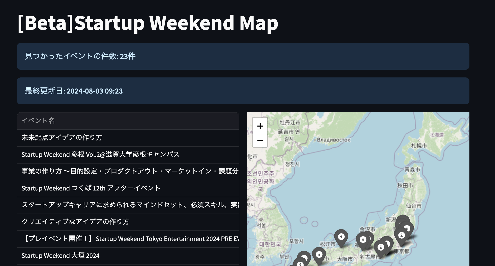

# swmap-jp: Startup Weekend Map in Japan

## これは何？

日本国内のStartup Weekendのイベント情報を地図上に表示するためのアプリケーションです。

## 使い方

以下のURLからアクセスできます。

[Startup Weekend Map in Japan](https://hrsano645.github.io/swmap-jp/)

<!-- <TODO: 2024-07-30 表示されるサイトの画像を入れる> -->


* イベント一覧には、イベント名、開催日時、開催場所、URLが表示されます。
* マップには上記情報が表示され、イベントページのリンクがあります。

## 今後やりたいこと

* 地域選択で絞る機能の実装
* SWのコミュニティ情報も載せる（コミュニティの紹介文とか）

## コントリビュート

* このリポジトリをforkして、プルリクエストを送ってください。

## 開発環境

[Streamlit](https://streamlit.io/)を利用しています。公開先では[stlite](https://edit.share.stlite.net)を利用しています。

Pythonは3.11を推奨です（stliteを利用するため）

### 環境構築

* このリポジトリをクローンします。
* pythonのvenvを作成し、activateします。
* `pip install -r requirements.txt`で必要なライブラリをインストールします。

### イベント一覧の更新方法

`update_sw_eventlist.py`を実行することで、イベント情報を更新できます。Googleスプレッドシート + Google Sheet APIを利用します。

#### Googleスプレッドシートの準備

Googleスプレッドシートの用意を行い、Google_Sheet_IDを取得してください。URLは`https://docs.google.com/spreadsheets/d/[sheet_id]/edit`のようになっています。

次にGoogle Cloud ConsoleでGoogle Sheet APIを有効にしてください。

Google Cloudの認証にはサービスアカウントを作成しjsonファイルを利用してください。`service_account.json`にて保存します。

サービスアカウントのメールアドレスを、Googleスプレッドシートの共有設定で共有します。権限は編集者にしてください。

Googleスプレッドシート内に最低２つのシートを作成してください。シート名は適切なものであれば何でも構いません。

* イベント一覧のシート
* 最終更新日時のシート

それぞれのシートを選択時にURLに記載されるgid=の値をGoogle_Sheet_DATA_GIDとGoogle_Sheet_LAST_RUN_TIME_GIDに設定してください。

例：`https://docs.google.com/spreadsheets/d/[sheet_id]/edit#gid=[gid]`

#### 環境準備

`.env`ファイルに以下の環境変数を設定してください。

```bash
DOORKEEPER_API_KEY=""
GOOGLE_SHEET_ID=""
GOOGLE_SHEET_DATA_GID=""
GOOGLE_SHEET_LAST_RUN_TIME_GID=""
```

* .envファイルを作成し、以下の環境変数を設定してください。
  * `DOORKEEPER_API_KEY`: Doorkeeper APIを利用する際のAPIキー (必須)
  Doorkeeper APIの取得方法はヘルプを参考にください。<https://www.doorkeeper.jp/developer/api?locale=en>
* Google_Sheet_ID: GoogleスプレッドシートのID (必須)
* Google_Sheet_DATA_GID: イベント一覧のGID (必須)
* Google_Sheet_LAST_RUN_TIME_GID: 最終更新日時のGID (必須)

index.htmlには、scriptタグ（javascript）の中に環境変数と同等の変数が設定されています。こちらの値を環境変数で設定したGOOGHE_SHEETのID,GIDと同等のものを設定してください。

```javascript
// javascript上の変数と環境変数の対応
let sheet_id = '[GOOGLE_SHEET_ID]'
let sheet_data_gid = '[GOOGLE_SHEET_DATA_GID]'
let sheet_last_run_time_gid = '[GOOGLE_SHEET_LAST_RUN_TIME_GID]'
```

#### イベント一覧の更新処理

`update_sw_eventlist.py`を実行することで、イベント一覧の更新が行われます。

Dockerfileでも実行可能です。crontabを使いDockerfileで実行する際は、以下のようにしてください。

```bash
# crontabに以下を追加
# 毎日午前3時に実行する例
0 3 * * * docker build -t swmap-jp-update-eventlist /[swmap-jpのディレクトリ]/ && docker run --rm swmap-jp-update-eventlist
```

### アプリケーションの起動

* Streamlit: `streamlit run streamlit_app.py`でアプリケーションを起動します。
* stlite: `python -m http.server` でローカルサーバーを立ち上げ、ブラウザで `http://localhost:8000/` にアクセスすると確認できます。

## ライセンス

[MIT License](./LICENSE)
